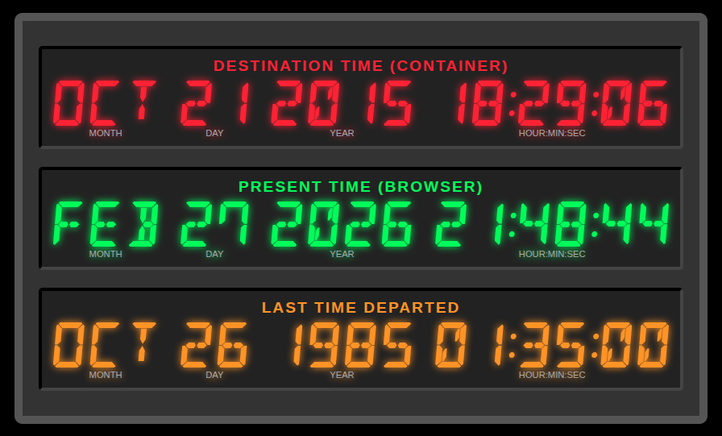

# Marty-McFly

Demo Application about timetravelling for containers

## About

This is a demo application for showing how one can move
containers through time, in docker and kubernetes. The trick is
to preload [libfaketime](https://github.com/wolfcw/libfaketime)
and to let this library do the time offset for the main process
of the container and its descendants.

The application itself is just a python/javascript application
simply showing the time inside the container.


## Licensing

This software is published under the GNU General Public License v3.0.
Please find details in the LICENSE file.

## Routes

### Main Page

The main page shows three lines of date and time in the style like
Emmett "Doc" Brown used them for the "time circuits" in his DeLorean
DMC-12 in the movie "[Back to the future](https://en.wikipedia.org/wiki/Back_to_the_Future)" from 1985:



* The top line ("Destination time") shows the time of the web application,
  means the time _inside the container_.
* The middle line ("Present time") displays the time of the browser (which
  should be the same as your time).
* The bottom line is static and shows Marty McFlys departure time from
  the year 1985 after the Lybian terrorist attack.

### /data

Responds with a JSON record containing
* the current time as ISO datestamp and as seconds since January 1st 1970
* as well as the content of the environment variables LD_PRELOAD and FAKETIME (if set).

Example:

```
{
  "date": {
    "iso":"2015-10-21T16:29:27+00:00",
    "epoch":1445444967
  },
  "env": {
    "FAKETIME":"@2015-10-21 16:29:00",
    "LD_PRELOAD":"/usr/lib/x86_64-linux-gnu/faketime/libfaketimeMT.so.1"
  }
}
```
The main page uses this to retrieve the time from inside the container.

## Time travel

The key to time travel for containers is **libfaketime**. It gets _preloaded_ via
the environment variable **LD_PRELOAD** and thus gets placed between the application
and the kernel, where it intercepts several system calls and is therefor able to
manipulate the time for the calling process.

The amount of time delta or the point in time gets passed to the library by the
environment variable **FAKETIME**. In short it may contain three types of values:
* _A time delta value_ in seconds, hours (h), days (d) or years (y). You could
  simulate a different timezone with "-12h" or test the same day one year ahead with "+365d".
* _A start time_ where the "internal clock" starts ticking, like "FAKETIME='@2026-12-31 23:59:00'"
  (pay attention to the "@"). Working with a bank? Within 60 seconds, you will know whether
  your programme calculates all balances correctly on New Year's Day.
* _A fixed point in time_ like "1985-10-26 01:20:00". For the application the clock stays at
  that point in time.

There's a lot more what libfaketime cando. Read more about it [here](https://github.com/wolfcw/libfaketime).
.

## Examples

### Docker

Assuming the application was built in an image named and tagged martymcfly:1.0.
You could let the application travel back to 2015 using the following docker
command on your local machine:
```
docker run --rm  -p 8080:8080 \
       --env=LD_PRELOAD=/usr/lib/x86_64-linux-gnu/faketime/libfaketimeMT.so.1 \
       --env=FAKETIME="@2015-10-21 16:29:00" \
       katalytic/martymcfly:1.0
```

### Kubernetes

Use the file deployment.yaml to deploy marty on a kubernetes cluster. It starts
one pod, listening on http/8080, and a service whichs listening on http/80.
You have to install an ingress, coupling it with the service, according to the
needs of your cluster setup.

If you're trying the setup on Killercoda, you may encounter a setup without
ingress controller. Install a bare metal nginx then:

```
sudo apt install nginx -y
```

Modify the default host in /etc/nginx/sites-enabled/default to
forward it to the IP of the marty service:

```
  location / {
    proxy_pass  http://10.99.149.179 ;
  }
```

(Re)load the nginx configuration:

```
sudo systemctl reload nginx.service
```

Now click on the burger button to the right, open the traffic/ports
page and there click on the "80" button. A page with the marty app
mainpage opens, displaying the time in- and outside.

