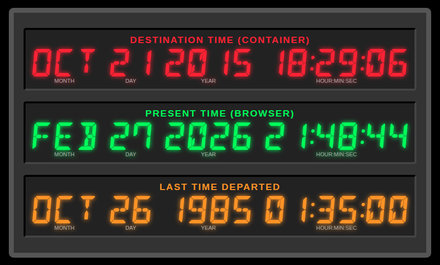

# Marty-McFly

Demo Application about timetravelling for containers.

Addition for Technies: The trick is to insert libfaketime via
the environment variable LD_PRELOAD.

## About

This is a demo application for showing how one can move
containers through time, in docker and kubernetes. The trick is
to preload [libfaketime](https://github.com/wolfcw/libfaketime)
and to let this library do the time offset for the main process
of the container and its descendants.

In this demo the library is already in the image, just to make
things easier. It's also possible to insert it via an
init container - which makes it possible to shift containers
through time *without making changes to code, app or image!*

The application itself is a python script serving the (inside)
time as JSON record at /data and a html/javascript browser
application simply displaying that time plus the actual
real time in the look of the time line displays Doc Brown
used in his DeLorean in the movie "Back to the future".


## Licensing

This software is published under the GNU General Public License v3.0.
Please find details in the LICENSE file.

The images in the folder img/ are licensed under CC BY-NC-SA.

## How it works

When starting the pod, kubernetes looks up the defined environment
variables in the deployment desciption and sets them. Placing the
path to libfaketime (which is in the image already) in the variable
**LD_PRELOAD**, the dynamic loader is loading the library *before*
the app is starting.

That way libfaketime sits *between* app and kernel where it intercepts
system calls related to time requests, so that it canmodify them.

Another environment variable **FAKETIME** controls the behaviour of
libfaketime. It may contain a *relative time offset* ("+42h"),
a timestamp to *start* the clock at ("@2015-10-21 16:29:00")
or a timestamp to *freeze* the clock at ("2015-10-21T16:29:27+00:00").
Now everytime the app asks the kernel about the time, it gets a
modified answer. 

The main html page of the Marty app displays the time *inside* the
container in the top row, by asking the app every one second.
The data is available via a simple API at /data, presenting
the time and the libfaketime env vars in a simple JSON record.

## When it does not work

There're a couple of cases where this trick doesn't work, for example:

* The underlying image is not based on glibc. E.g. the alpine is based
  on [musl libc](https://musl.libc.org/) so the libfaketime library
  won't work here.
* The target binary is linked statically, e.g. compiled go binaries.
  These don't work via glibc so they bypass libfaketime library.

However, everyday experience with containers shows that in the vast
majority of cases, manipulating the time using `libfaketime` works.

## Routes

### Main Page

The main page shows three lines of date and time in the style like
Emmett "Doc" Brown used them for the "time circuits" in his DeLorean
DMC-12 in the movie "[Back to the future](https://en.wikipedia.org/wiki/Back_to_the_Future)" from 1985:



* The top line ("Destination time") shows the time of the web application,
  means the time _inside the container_.
* The middle line ("Present time") displays the time of the browser (which
  should be the same as your time).
* The bottom line is static and shows Marty McFlys departure time from
  the year 1985 after the Lybian terrorist attack.

### /data

Responds with a JSON record containing
* the current time as ISO datestamp and as seconds since January 1st 1970
* as well as the content of the environment variables LD_PRELOAD and FAKETIME (if set).

Example:

```
{
  "date": {
    "iso":"2015-10-21T16:29:27+00:00",
    "epoch":1445444967
  },
  "env": {
    "FAKETIME":"@2015-10-21 16:29:00",
    "LD_PRELOAD":"/usr/lib/x86_64-linux-gnu/faketime/libfaketimeMT.so.1"
  }
}
```
The main page uses this to retrieve the time from inside the container.

## Time travel

The key to time travel for containers is **libfaketime**. It gets _preloaded_ via
the environment variable **LD_PRELOAD** and thus gets placed between the application
and the kernel, where it intercepts several system calls and is therefor able to
manipulate the time for the calling process.

The amount of time delta or the point in time gets passed to the library by the
environment variable **FAKETIME**. In short it may contain three types of values:
* _A time delta value_ in seconds, hours (h), days (d) or years (y). You could
  simulate a different timezone with "-12h" or test the same day one year ahead with "+365d".
* _A start time_ where the "internal clock" starts ticking, like "FAKETIME='@2026-12-31 23:59:00'"
  (pay attention to the "@"). Working with a bank? Within 60 seconds, you will know whether
  your programme calculates all balances correctly on New Year's Day.
* _A fixed point in time_ like "1985-10-26 01:20:00". For the application the clock stays at
  that point in time.

There's a lot more what libfaketime cando. Read more about it [here](https://github.com/wolfcw/libfaketime).
.

## Examples

### Docker

Here's how you could let the application travel back to 2015 using the following docker
command on your local machine:
```
docker run --rm  -p 8080:8080 \
       --env=LD_PRELOAD=/usr/lib/x86_64-linux-gnu/faketime/libfaketimeMT.so.1 \
       --env=FAKETIME="@2015-10-21 16:29:00" \
       katalytic/martymcfly:1.0
```

### Kubernetes

Use the file deployment.yaml to deploy marty on a kubernetes cluster. It starts
one pod, listening on http/8080, and a service which is listening on http/80.
To access the app from the outside world,
you'll have to install an ingress according to the needs of your cluster setup
and the link it to the marty service.

If you're trying the setup on Killercoda, you may encounter a setup without
ingress controller. Install a bare metal nginx then:

```
sudo apt install nginx -y
```

Modify the default host in /etc/nginx/sites-enabled/default to
forward it to the IP of the endpoint which you may find in the
marty service:

```
  location / {
    proxy_pass  http://${IP of the endpoint listed in the marty service} ;
  }
```

(Re)load the nginx configuration:

```
sudo systemctl reload nginx.service
```

Now click on the burger button to the upper right, open the traffic/ports
page and there click on the "80" button. A page with the marty app
mainpage opens, displaying the time "inside and outside".

## AI notice

The html/javascipt mainpage of the Marty app was made using AI (Gemini).

## Author
This software was brought to you by katalytic IT. Visit our
website at https://www.katalytic-it.com .

